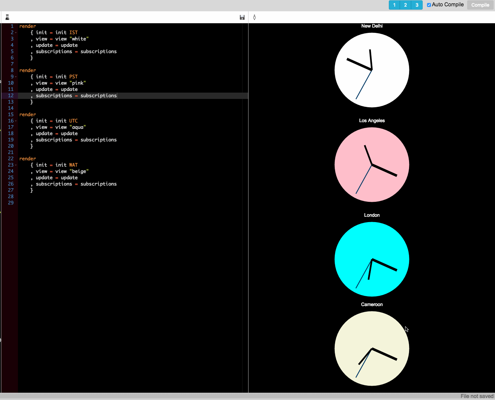

# elm-analog-clock

Analog svg clocks. Has four time zones currently. Can change background color.

Built using frolic - [https://github.com/mukeshsoni/frolic](https://github.com/mukeshsoni/frolic)
